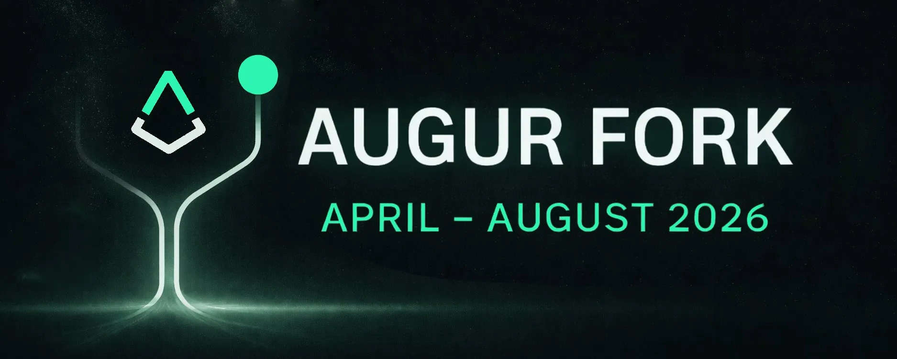

**If you hold REP, starting in June you will have 2 months to migrate your tokens or risk losing them.**

On April 8, Augur entered a 4-month fork process over a dispute on whether the Artemis II mission successfully lifted off (it did). This is an intentional trigger of the mechanism by Augur community member Micah Zoltu for testing and demonstration.

The process has two phases:

- **Phase 1 (April → June): Escalation Game** — REP is staked on competing outcomes. Participation is optional.
- **Phase 2 (June → August): Migration** — A 2-month window where all REP holders must migrate their tokens 1:1 into the new version, which is where Augur development will continue. **Participation is mandatory.**

Tooling to participate in this fork is available at [6.augurfork.eth.limo](https://6.augurfork.eth.limo/#/reporting?market=0x963eed85778cc23e2d4636cd4f29eecdf9827e9e), along with a Usage Guide and [FAQ](https://augur.net/faq/).

The Lituus Foundation is working with exchanges such as Kraken and Gate to support migration on behalf of users. However, support is not yet confirmed. Check back periodically for updates or withdraw the REP to your own wallet and complete the migration yourself.

Future official Augur development, funded by the foundation, will continue on the fork corresponding with truth.

Below is additional information on the what, why, when, and how.

## What is the fork?

The fork is the second phase and final backstop of Augur's dispute system. It ensures that truth is enforced by economic incentives rather than trusted councils or centralized decision-makers.

When disagreements escalate far enough, the system splits into multiple versions (universes), one for each possible outcome.

At that point:

👉 REP holders must choose a universe by migrating their REP

The universe that reflects reality keeps economic value, because that's where usage and fees will remain. The others, including the attacker's, become worthless.

This is why REP is not a passive asset — it is the actions of REP holders that shift value away from attackers and force them to lose money.

## Why is the fork happening?

This fork is an intentional test of Augur's core mechanism.

It was triggered by Augur community member Micah Zoltu to run the system end-to-end under real conditions.

The goal is simple:

👉 Prove that Augur's fork works in practice, not just in theory

The test will ensure:

- The system behaves as expected and incentives work
- The ecosystem is ready for future forks
- REP holders are woken up and understand their role in securing the protocol

This is a controlled run of the most important part of Augur's design.

## When will everything take place?

The fork runs for **~4 months** and has two phases:

**Phase 1: Escalation Game (April 8 → June)**

- REP is staked on competing outcomes
- The dispute escalates over multiple rounds
- REP staked on winning outcome receives an extra 40% from losers

👉 Participation is optional

👉 Most users do not need to do anything here

**Phase 2: Migration (June → August)**

- The system splits into multiple universes
- **All REP holders must take action**
- After the migration the old token cannot be converted anymore

👉 You will have ~2 months to migrate your REP

👉 This is the only step that matters for most users

## What do I need to do?

If you hold REP, you do not need to understand every detail of the fork.

You only need to do one thing:

👉 **Migrate your REP during the June–August window**

That's it.

**Quick checklist:**

- Hold REP in your own wallet, or confirm your exchange supports migration
- Check [6.augurfork.eth.limo](https://6.augurfork.eth.limo/) for the official migration tool
- Follow official Augur updates for timing and instructions

**Key rules:**

- Migration is **required**
- Migration is **one-way and irreversible**
- Missing the window likely means your REP becomes worthless

## Final note

This is a rare event.

It's how Augur proves that a system can resolve truth without relying on trust, authority, or intervention.

And it only works if REP holders participate.

👉 **If you hold REP, be ready to act in June.**

For more information, join the [Discord](https://discord.gg/aNBTq55) and follow [@AugurProject](https://x.com/AugurProject) on X to stay up to date.

**— The Lituus Foundation**
